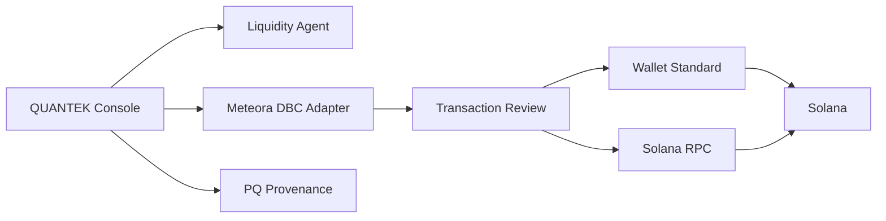

<div align="center">
  
  <h1>QUANTEK</h1>
  <p><strong>Post-quantum-attested operations for Meteora Dynamic Bonding Curve pools.</strong></p>
  <p>Non-custodial Solana liquidity planning, launch operations, transaction review, and verifiable provenance.</p>
</div>

<div align="center">

[](https://github.com/quantekdbc/quantek/actions/workflows/ci.yml)
[](./LICENSE)
[](./package.json)
[](https://solana.com/)
[](https://docs.meteora.ag/)

</div>

> **Alpha software.** QUANTEK currently includes simulated/demo operational data and a public PQ proof reference implementation. It must not be treated as audited production trading or custody software.

## What QUANTEK is

QUANTEK is a browser-first operations console for Solana launches and liquidity workflows built around Meteora's Dynamic Bonding Curve (DBC). The product now includes Standard Launch, Quantum Launch, qtk1 Identity, Quantum Wallet protocol readiness, independent proof verification, and tokenized-market quote assets.

It combines:

- Standard and Quantum DBC launch configuration and DAMM v2 migration planning;
- crypto and tokenized-stock/ETF quote markets with live RPC mint validation;
- deterministic liquidity-agent strategy previews;
- wallet-standard client-side signing boundaries;
- exact transaction-review byte checks;
- pool, fee, reserve, and migration operational surfaces;
- WOTS-16 / SHA-256 post-quantum provenance experiments;
- explicit security and audit boundaries.

QUANTEK does **not** custody funds, request seed phrases, or silently sign transactions.

## Architecture



The core protocol and trust boundaries live outside presentation components:

- `src/lib/quantek/dbc.ts` — Meteora DBC SDK boundary;
- `src/lib/quantek/wallet.ts` — review/simulation/signing integrity boundary;
- `src/lib/quantek/pq.ts` — browser-side public PQ demonstration verifier;
- `src/lib/quantek/context.tsx` — session, wallet, RPC, and audit state.

See [Architecture](./docs/ARCHITECTURE.md) for the complete model.

## Capabilities

| Area | Current state |
| --- | --- |
| Standard Launch on Meteora DBC | Implemented |
| Quantum Launch + QUANTEK Attestation Seal | Implemented (WOTS reference path) |
| 61 xStocks tokenized-market quote presets | Implemented; live RPC verification required |
| qtk1 Identity Derive / Register / Anchor / Prove | Implemented as local reference identity |
| Quantum Wallet protocol UX | Implemented; on-chain verifier **not deployed** |
| In-app technical Docs | Implemented |
| Meteora DBC SDK adapter | Implemented |
| DBC program ownership checks | Implemented |
| DAMM v2 default migration policy | Implemented |
| Pool/config/state service boundaries | Implemented |
| Wallet Standard connection | Implemented |
| Exact reviewed-message integrity checks | Implemented |
| RPC genesis/network verification | Implemented |
| Blockhash validity checks | Implemented |
| Pre-sign transaction simulation | Implemented |
| Deterministic liquidity-agent plans | Implemented |
| Live autonomous signing | **Not enabled** |
| WOTS-16 / SHA-256 demo proof verification | Implemented |
| Production PQ key management | **Not implemented** |
| Production execution/submission layer | Roadmap |

## Meteora DBC

QUANTEK integrates `@meteora-ag/dynamic-bonding-curve-sdk` behind a typed service boundary.

DBC program:

```text
dbcij3LWUppWqq96dh6gJWwBifmcGfLSB5D4DuSMaqN
```

New configuration flows default to:

```text
MET_DAMM_V2
```

Service groups include partner, creator, pool, migration, and state operations.

Read [Meteora DBC integration](./docs/METEORA_DBC.md).

## Transaction integrity

The signing model is intentionally conservative:

1. build an unsigned transaction;
2. assign fee payer and a fresh blockhash;
3. serialize and freeze the message shown for review;
4. verify the RPC cluster;
5. simulate that exact reviewed transaction;
6. re-check the transaction after simulation;
7. request wallet signing;
8. verify the wallet returned the same message;
9. reject missing or invalid signatures.

The current signing helper returns signed bytes and does **not** silently submit them.

Read [Transaction model](./docs/TRANSACTION_MODEL.md).

## Post-quantum provenance

The current reference model uses:

| Parameter | Value |
| --- | --- |
| Hash | SHA-256 |
| WOTS parameter | `w = 16` |
| WOTS chains | 67 |
| Merkle height | 8 |
| Leaf budget | 256 |

The current `quantek-demo-wots-v1` proof format is a public demonstration/reference format. Its deterministic demo material is not production signing material.

Most importantly: **PQ provenance does not replace Solana's ed25519 transaction authorization.** It can attest to provenance/identity; it does not make ordinary Solana wallet balances post-quantum secure.

Read [PQ identity](./docs/PQ_IDENTITY.md).

## Liquidity Agent

The agent is a deterministic control plane rather than a custodial bot.

Modes:

- **Observe** — read and preview;
- **Guarded** — proposals require explicit wallet approval;
- **Autonomous** — scheduling semantics only; autonomous signing is not enabled.

Guardrails cover inventory bands, slippage, trade size, SOL reserves, cooldowns, action rate, fee thresholds, RPC degradation, migration proximity, and wallet state.

Read [Liquidity Agent](./docs/LIQUIDITY_AGENT.md).

## Quick start

Requirements:

- Node.js 22+
- npm 10+

```bash
git clone https://github.com/quantekdbc/quantek.git
cd quantek
npm install
npm run dev
```

Quality checks:

```bash
npm run lint
npm run typecheck
npm run test
npm run build
```

See [Getting started](./docs/GETTING_STARTED.md).

## Security

Security-sensitive invariants are covered by automated tests, including:

- post-review transaction mutation rejection;
- RPC/network mismatch rejection;
- stale blockhash rejection;
- failed simulation rejection;
- wallet-modified transaction rejection;
- missing-signature rejection;
- unsafe RPC URL rejection;
- malformed PQ proof rejection;
- WOTS demo-proof tamper rejection;
- DAMM v2 migration defaults.

For vulnerabilities, do not open a public exploit report. Follow [SECURITY.md](./SECURITY.md).

Read the [Threat model](./docs/THREAT_MODEL.md) and [Testing guide](./docs/TESTING.md).

## Documentation

| Document | Purpose |
| --- | --- |
| [Getting Started](./docs/GETTING_STARTED.md) | local development and demo semantics |
| [Architecture](./docs/ARCHITECTURE.md) | components, service boundaries, trust model |
| [Meteora DBC](./docs/METEORA_DBC.md) | SDK integration and migration policy |
| [Launch](./docs/LAUNCH.md) | Standard/Quantum DBC launch lifecycle |
| [Quantum Launch](./docs/QUANTUM_LAUNCH.md) | QUANTEK attestation model |
| [Identity](./docs/IDENTITY.md) | qtk1 derivation, registration, anchor and proofs |
| [Quantum Wallets](./docs/QUANTUM_WALLETS.md) | one-time WOTS vault-chain architecture |
| [Tokenized Markets](./docs/TOKENIZED_MARKETS.md) | RWA quote-mint validation and policy |
| [Liquidity Agent](./docs/LIQUIDITY_AGENT.md) | strategy model and guardrails |
| [Transaction Model](./docs/TRANSACTION_MODEL.md) | construction, review, simulation, signing |
| [PQ Identity](./docs/PQ_IDENTITY.md) | WOTS/Merkle provenance model |
| [Threat Model](./docs/THREAT_MODEL.md) | adversaries, assumptions, mitigations |
| [Testing](./docs/TESTING.md) | quality and security coverage |
| [Roadmap](./docs/ROADMAP.md) | planned development phases |

## Repository structure

```text
quantek/
├── .github/                 # CI, Dependabot, issue/PR templates
├── docs/                    # architecture and security documentation
├── public/                  # QUANTEK mark and static assets
└── src/
    ├── components/
    │   ├── quantek/         # product surfaces
    │   └── ui/              # reusable UI primitives
    ├── lib/quantek/         # DBC, wallet, PQ, validation, state
    ├── routes/              # TanStack routes
    └── test/                # routing, PQ, wallet and DBC boundary tests
```

## Contributing

Contributions are welcome. Read [CONTRIBUTING.md](./CONTRIBUTING.md) before opening a pull request.

Security-sensitive changes should include explicit test coverage and describe any change to transaction construction, signing, RPC trust, protocol accounts, or cryptographic verification.

## Roadmap

The roadmap prioritizes live-read DBC integration, explicit transaction submission/confirmation, production-grade provenance key management, and operational hardening.

See [docs/ROADMAP.md](./docs/ROADMAP.md).

## License

Licensed under the [Apache License 2.0](./LICENSE).

Copyright 2026 QUANTEK contributors.
