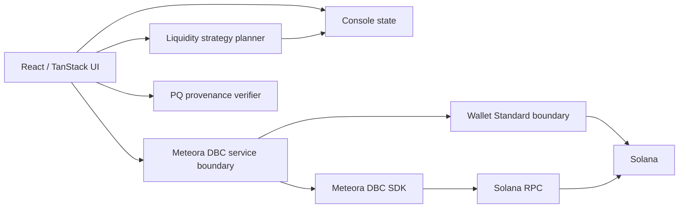

# QUANTEK Architecture

QUANTEK is a browser-first, non-custodial operations console for Solana liquidity workflows.

## Design goals

1. Keep wallet authority with the user.
2. Separate deterministic planning from transaction construction.
3. Make simulation and review explicit.
4. Treat RPC/network mismatch as a fail-closed condition.
5. Keep post-quantum provenance separate from Solana transaction authorization.
6. Keep protocol adapters isolated from UI components.

## High-level architecture

## Repository layers

### `src/components/quantek`

Product-facing surfaces:

- overview telemetry;
- liquidity-agent strategy controls;
- DBC launch configuration;
- pool, position, and fee operations;
- PQ identity and verification;
- transaction-review controls.

These components should not own wallet secrets or bypass service boundaries.

### `src/lib/quantek/dbc.ts`

Protocol adapter around `@meteora-ag/dynamic-bonding-curve-sdk`.

It exposes partner, creator, pool, migration, and state services and centralizes:

- the Meteora DBC program id;
- DAMM v2 as the default migration target;
- RPC validation;
- pool account-owner validation;
- unsigned transaction preparation;
- simulation;
- fee/account review data.

### `src/lib/quantek/wallet.ts`

Client-side signing boundary. The reviewed message bytes are frozen and rechecked before and after simulation and again after wallet signing.

This module returns signed bytes. It does **not** expose a transaction-submission API.

### `src/lib/quantek/pq.ts`

Browser-side demonstration/reference implementation of the WOTS-16 / SHA-256 verification model used by the current UI.

The current `DemoProof` format is explicitly a public demonstration format and must not be represented as production launch-attestation key material.

### `src/lib/quantek/context.tsx`

Session-scoped UI state:

- network and RPC selection;
- wallet-standard discovery and connection;
- RPC health;
- local audit events;
- execution plan state;
- session strategy snapshots.

## Trust boundaries

| Boundary | QUANTEK trusts | QUANTEK does not assume |
| --- | --- | --- |
| Wallet | explicit user signing | custody or silent signing |
| RPC | responses after network checks | that arbitrary RPC endpoints are correct |
| DBC accounts | owner checks + SDK decoding | arbitrary accounts are DBC pools |
| PQ proofs | verified hash-chain/Merkle relationships | protection of Solana ed25519 funds |
| Demo data | local UI fixtures | live market truth |

See [THREAT_MODEL.md](THREAT_MODEL.md) for adversarial assumptions.
